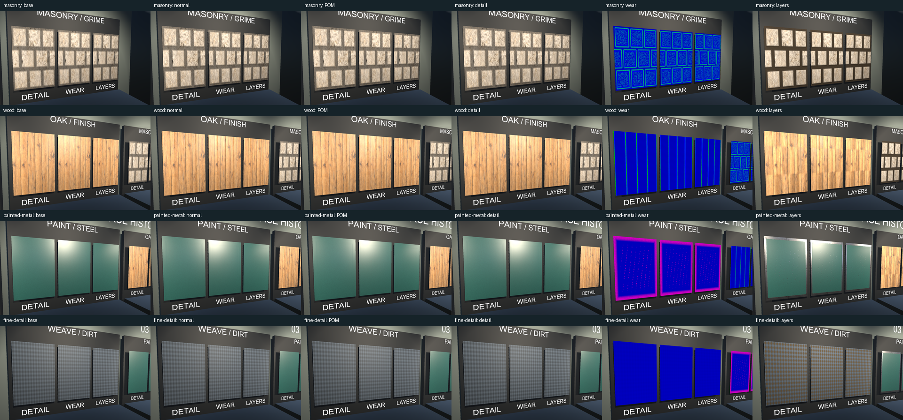
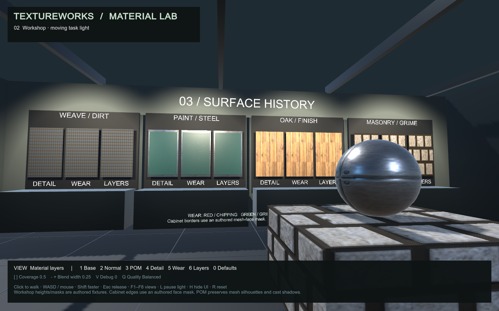
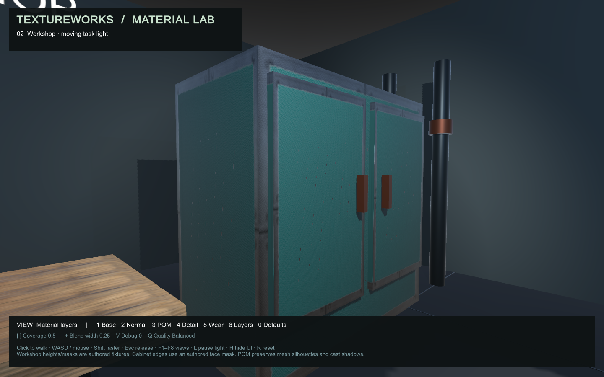

# Material cluster validation

Recorded 2026-09-08, America/Denver. This accepts the first detail, wear and
two-material cluster in the Unity Material Lab. The [algorithm contract](../reference/material-fields.md)
and [bundle reference](../reference/material-bundles.md) describe the shipped
behavior. The expanded tier proposals remain background research.

## Reproduce

Use the project's CuPy environment and Unity 6000.6.0f1. From the repository root:

```powershell
.\.venv\Scripts\python.exe -m scripts.prepare_material_cluster
.\.venv\Scripts\python.exe -m pytest tests/ -v
# With the lab open in the installed editor:
.\scripts\test-material-lab.ps1 -UseOpenEditor -Rebuild
.\scripts\test-material-cluster-player.ps1
```

`-Rebuild` regenerates the scene after preserving dirty scene copies under
`Assets/Evidence/SceneBackups`. Without it, validation requires saved scenes and
opens the committed MaterialLab scene. With the editor closed, omit
`-UseOpenEditor` to use the existing GPU batch path. Do not open the same project
in a second editor. `-SkipBuild` supports capture iteration after a build.
The open-editor script waits for Pipeline readiness across domain reload and
retries only readiness reads, never failed assertions or scene/build commands.

The visible Windows smoke probe visits six viewpoints with the HUD, measures
18 timing cases and exits. It records runtime exceptions and rejects missing,
blank or error-magenta screenshots. A normal player launch does not activate
the probe or a runtime command server. The player script checks report freshness
and writes copies under `Evidence/cluster/player-d3d11`.

For editor timing, enter Play Mode and invoke `cluster_profile` with the Unity
CLI. It writes `Evidence/cluster/editor-performance.json` when finished. Keep
other GPU tests idle during this measurement. Exit Play Mode before running:

```powershell
.\.venv\Scripts\python.exe -m scripts.benchmark_material_cluster
.\.venv\Scripts\python.exe -m scripts.review_material_cluster
```

The review script arranges all 192 motion frames in local contact sheets and
copies representative captures, compressed animations and JSON reports into
this document's assets folder. It does not decide visual acceptance. The full
resolution captures and logs remain in ignored `Evidence` and `output` folders.

## Numerical and import evidence

Hardware/software: NVIDIA GeForce RTX 5070, 12 GB, compute capability 12.0;
Python 3.14.0, CuPy 14.0.1; Unity 6000.6.0f1, URP 17.6.0, Unity CLI
1.0.0-beta.6, Pipeline 0.6.0-exp.1. All GPU render checks below use Direct3D11.

- Full Python suite: **111 passed, zero skips**. Both new backends agree within
  the declared tolerance; independent assertions establish frequency response,
  physical normal direction, convex/concave curvature signs, ramp neutrality,
  deterministic wear, supported boundaries, extrema and exact composition
  endpoints. No legacy tolerance was relaxed.
- Bundle tests preserve authored bytes, scalar 16-bit precision and explicit
  normal conventions, reject malformed metadata and incompatible images, and
  exercise API/CLI generation, external detail, batch collisions, hashes and
  deterministic regeneration. Shared exported height is computed/quantized once.
- The 0.2.0 wheel builds successfully, includes PTX source, and generates and
  verifies the masonry bundle when loaded from an isolated install directory.
  The build backend and package discovery/data declarations were corrected to
  make that installation work. All library files parse using Python 3.10 syntax;
  this machine's executed runtime was 3.14, not a separate 3.10 environment.
- [Cluster report](assets/material-cluster/validation.json): **425 checks**.
  Actual HLSL is rendered against a CPU double-precision composed field and
  independently searched intersections. Normals include the weight-gradient
  term. RNM is checked against quaternion shortest-arc rotation, including
  neutral detail and zero strength. The actual Layered Lit shader also renders
  authored OpenGL/DirectX normals and linear albedo/roughness/metallic/AO at
  weights 0, 0.5 and 1 against independent expected values.
  Importer rejection tests cover incompatible normal provenance, boundary mode
  and height encoding before any import settings are changed.
- All eight cluster height textures import as linear R16. Masonry preserves
  4,469/2,503 distinct levels, painted metal 678/666, and wood 1,545/1,540.
  The deliberately discrete sine-weave fixture has nine levels per height.
  A separate GPU test distinguishes adjacent R16 codes; format alone is not
  the precision test. Imports also enforce dimensions, raw XYZ encodings,
  independent detail boundary mode, trilinear mipmaps and anisotropy 4.
- [Foundation lab report](assets/material-cluster/lab-validation.json):
  **41 checks**, including original gallery materials, illumination, traversal
  through the workshop doorway, floor collision and blocked wall movement.

The [unchanged baseline POM harness](parallax-validation.md) was rerun on the
pinned editor: 33 analytic GPU checks and 140 geometric comparisons passed.
Its [current geometric report](assets/material-cluster/parallax-regression.json)
contains 40 fixed comparisons and 100 motion frames, with worst motion p99
error 0.00847 height texels. The dense displaced-mesh overview was inspected.
These geometric results apply to the baseline include; layered POM uses its
own independent analytic intersection checks described above.

## Rendered and player acceptance

The [Windows build](assets/material-cluster/player-build.json) succeeded with
zero errors and one expected warning: Pipeline is disabled in player builds
because there is no runtime configuration. Shader drawer and uninitialized
return warnings found during development were corrected; they are absent from
the final build. The [player smoke report](assets/material-cluster/player-smoke.json)
records Direct3D11, 1440×900 and zero runtime errors.

All four materials have fixed 1440×900 captures of six stages on identical
geometry, camera and illumination. Every nonzero detail case changes the image.
At zero detail strength, beyond its fade end, and at all-A coverage with detail
disabled, rendered pixel differences from the base POM are exactly zero. All-B
coverage works at zero width and visibly changes each material. The cabinet
also responds to the moving task light at a fixed camera; normalized mean image
difference was 0.00504.

The fixed renders, debug maps, cabinet illumination pair, player HUD and all
four 48-frame motion sequences were inspected. Motion covers a close orbit
through -68 to +68 degrees, return to the front, and retreat from 1.6 to 8 meters.
Selected original frames were checked as well as the contact sheets; reduced
contact sheets can themselves introduce aliasing. Fine detail fades without an
abrupt cutoff in these views. Thin-feature recovery at arbitrary angles remains
bounded by the POM step count.

Visual correction addressed duplicated mortar inherited from the original color
source, insufficient cabinet illumination, overly broad camera sweeps leaving
the room, an overview too close to read, and base clamp sampling accidentally
clamping repeating detail. Masonry now uses a recorded stone-interior crop plus
an authored mortar layout. Periodic microdetail is constructed explicitly from
Fourier components. This does not claim that wrapped filtering makes arbitrary
source imagery seamless. Repetition remains visible in these small fixtures.

Masonry grime occupies authored recesses. Cabinet paint exposes a lower steel
field at an authored cube-face border mask and sparse scratches. Wood removes
surface finish; it does not pretend to infer chipped silhouette corners. Weave
is fully analytic. Existing generated colors retain their original prompts and
generator provenance under `textures/pom-validation`; no new image-generation
model was used for these analytic fixtures. These are controlled appearance
demonstrations, not measurements recovered from albedo.







[Paint motion](assets/material-cluster/painted-metal-motion.webp) and
[fine-detail motion](assets/material-cluster/fine-detail-motion.webp) are reduced
animated review copies; the original 960×600 PNG frame sequences are regenerated
by `cluster_validate`. The [composed-height view](assets/material-cluster/composed-height.png)
and [layer-weight view](assets/material-cluster/layer-weight.png) expose the
sampled fields separately from lit appearance.

## Measured cost

Both probes use forward URP, 4× MSAA, ACES, fixed camera and illumination, hidden
HUD, VSync off and uncapped rendering, with 45 warmup and 120 sampled frames for
each of 18 cases. `FrameTimingManager` samples are deduplicated by timestamp;
available GPU sample counts are retained in the reports. These are whole-frame
measurements on this scene and GPU. Timing variation and CPU scheduling make
small differences noisy; they are not isolated kernel timings or a general FPS
promise.

| Windows player, 1440×900 | POM only median GPU ms | POM + detail | Layers + detail | Layers GPU p95 |
| --- | ---: | ---: | ---: | ---: |
| Overview, balanced 16–64/4 | .317 | .331 | .373 | .819 |
| Cabinet, balanced 16–64/4 | .269 | .279 | .383 | .997 |

The [player report](assets/material-cluster/player-performance.json) includes
all quality cases. Layered GPU medians at low/balanced/high are
.333/.373/.448 ms for the overview and .317/.383/.457 ms for the cabinet.
The low setting uses 8–24 march samples and two refinements. It reduces reads
but can miss thin relief that falls between march samples. Balanced is the
material default; high uses 32–128/6. Coverage endpoints skip the unused height
and mask reads during tracing.

The [editor report](assets/material-cluster/editor-performance.json) is separate,
at 1920×1080: balanced POM+detail versus layers+detail measured .653/.710 ms
for the overview and .574/.731 ms for the cabinet. These editor numbers should
not be subtracted from player results because resolution and editor overhead
differ. The two player balanced layered cases had median frame intervals near
.472 ms during this uncapped probe; ordinary walking restores the normal frame
and input settings.

[Field benchmarks](assets/material-cluster/field-benchmarks.json) record all five
new generators at 1024, 2048 and 4096 with both backends, 100 timed repeats after
warmup and public input validation included. The dedicated script fails on
generator errors. An earlier attempted all-map run was interrupted during the
legacy AO workload and supplies no completed benchmark claim.

## Supported scope and remaining tiers

Tier 2 ships frequency-separated color/detail normals, external detail sources,
RNM, tiling/strength, optional roughness modulation and smooth distance fading.
Histogram-preserving stochastic tiling and anti-repetition are deferred.

Tier 5 ships physically scaled signed height curvature, independently controlled
edge/cavity wear, stable seeded variation and authored mask overrides. Mesh
curvature extraction, object/world-oriented dust and directional streaks are
deferred. UV relief cannot establish silhouette wear.

Tier 7 ships two materials composed during runtime POM and sampled consistently
across height, normals and all lit channels. Three or more layers, texture arrays
and broader layer-management workflows are deferred. Offline preview maps are
diagnostics and do not substitute for the runtime path.

The validated target is this Windows Direct3D11 player. Direct3D12 shader variants
compile in the build, but this cluster has no Direct3D12 runtime acceptance run.
Other graphics APIs, platforms and pipelines are unvalidated. Mesh silhouettes,
cast shadows and collision remain geometric; the profile has no relief
self-shadowing, baked lightmap integration, XR or deferred-renderer acceptance.
Valid tangents and orthogonal UV axes are required. Automated movement and
captured views passed; a person's keyboard/mouse walkthrough remains a separate
acceptance activity.

There is no configured GitHub Actions workflow. Local test/build evidence and
the PR's actual GitHub check status must be reported separately.
