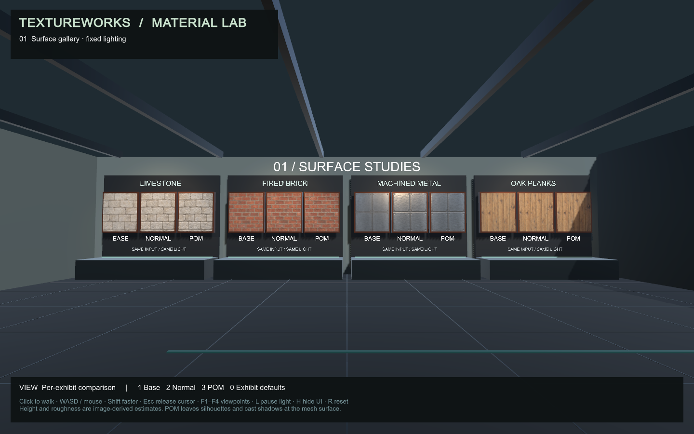
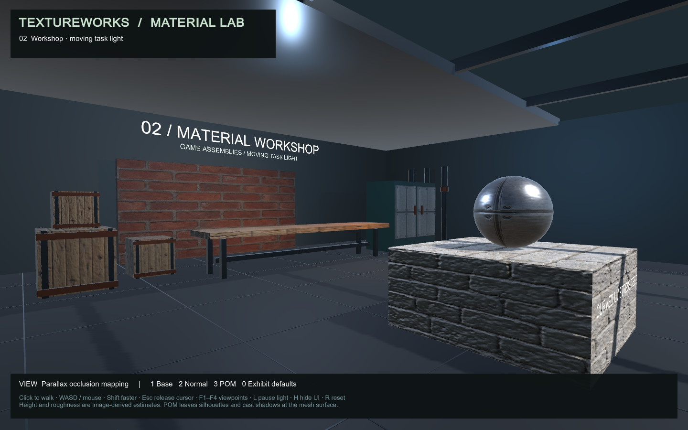

# Material Lab validation

This is acceptance evidence for the demonstration foundation, not completion of
the next advanced material tiers. The lab consumes the existing POM include in
an actual URP lighting shader and a Windows player.

## Reproduce

With the editor closed, from the repository root:

```powershell
.\scripts\test-material-lab.ps1
```

The script uses Unity 6000.6.0f1 by default; pass `-UnityEditor` for a different
installation of that version. It builds a Windows player, enters Play Mode with
a real Direct3D11 GPU in Batch Mode, renders the scene and checks movement. Its
ten-minute timeout includes import and building. `-SkipBuild` is available for
iterating on scene/render checks after a build has already been validated.

Reports and camera captures are written to the project's `Evidence` directory.
Failed assertions cause a nonzero process exit. The script requires the pass
marker from the current log; a report left over from a previous run cannot make
a failing run pass.

The [walking guide](../how-to/material-lab.md) explains the interactive controls,
CLI commands and regeneration. A bounded editor automation session can also be
started with the Unity editor executable using `-batchmode -force-d3d11`, the lab's
`-projectPath`, and
`-executeMethod TextureWorks.MaterialLab.Editor.LabValidation.OpenAutomationSession`.
It exits after five minutes, or when `unity command lab_finish_automation` is
called. That command refuses to close an interactive editor.

For player acceptance, launch the built executable visibly with
`-textureworks-smoke -force-d3d11`. It visits two viewpoints, captures the rendered
HUD, rejects blank/error-magenta output, records runtime exceptions, writes
`player-smoke.json` beside the executable and exits. A normal launch does not
run this probe. Windows suppresses useful backbuffer rendering for a hidden
player window, so hidden launch is unsuitable for this screenshot check.

## Recorded run: 2026-09-08, America/Denver

Environment: Unity 6000.6.0f1, URP 17.6.0, Unity CLI 1.0.0-beta.6, Pipeline
0.6.0-exp.1, NVIDIA GeForce RTX 5070. The Python environment used Python 3.14,
CuPy 14 and pytest 9. The [lab report](assets/material-lab/validation.json)
contains 33 passing checks with 1440×900 Direct3D11 camera captures:

- Four height maps retain linear R16 precision, with 18,646–21,892 distinct levels.
- All 155 renderers have supported materials; exercised POM variants compile.
- Ten captures contain visible illumination and no significant error-magenta area.
- POM changes the same oblique surface view; a moving task light changes workshop
  illumination. These checks detect missing effects, not physical correctness.
- The visitor crosses the gallery and workshop doorway with floor collision,
  while an attempted walk through the south wall is blocked.

The [Windows build](assets/material-lab/player-build.json) succeeded with zero
errors. Its one warning reports that Pipeline has no runtime configuration and
is disabled in player builds, which is the intended configuration. The
[Direct3D11 player smoke report](assets/material-lab/player-d3d11.json) records
no runtime errors and valid gallery/workshop captures with the HUD.
The [Direct3D12 player smoke report](assets/material-lab/player-d3d12.json)
also passed on the same machine. Quantitative POM/geometry comparisons were
performed on Direct3D11; the Direct3D12 evidence covers the demo player smoke test.

The CLI connected to a running batch editor and successfully executed `lab_view`,
`capture_game_view`, `lab_validate`, `editor_stop`, `lab_build_windows` and
`lab_finish_automation`. Project creation and registration also used the Unity CLI.

The unchanged POM algorithm passed 33 analytic GPU checks and 140 comparisons
against displaced geometry on Unity 6.6. See the
[POM validation record](parallax-validation.md). The full Python suite passed
**51 tests, zero skips**. There is no configured GitHub Actions workflow; these
are local results.

## Visual review and remaining limits

The gallery, close oblique POM view, workshop, cabinet, and player HUD were
inspected. Early revisions exposed an SRP constructor change, overflowing labels,
text drawing through walls and implausibly glossy stone/wood. The final integration
uses Unity's version-aware texture macro, depth-tested signs, smaller labels and
documented authored roughness limits. The source map generators are unchanged.

The scenes use fixed realtime lights and an animated task light. Baked lighting,
mesh silhouette displacement, relief self-shadowing, general skewed UV handling,
and a production shader feature matrix are outside this foundation. The ordinary
keyboard/mouse path is implemented, while the automated walking checks exercise
the same CharacterController movement path with scripted destinations. Human
walkthrough acceptance remains a separate step.

Unity 6.6's batch editor emitted an internal `UnityEditor.Search.SearchDatabase`
indexing exception during startup and allocation notices during shutdown. They
did not prevent scene/render checks or the player build. The Windows player
smoke runs reported no runtime errors. Logs are retained locally under `Logs`.
The interactive editor's first-launch Software Terms dialog requires the user's
review; accepting terms is not automated.




