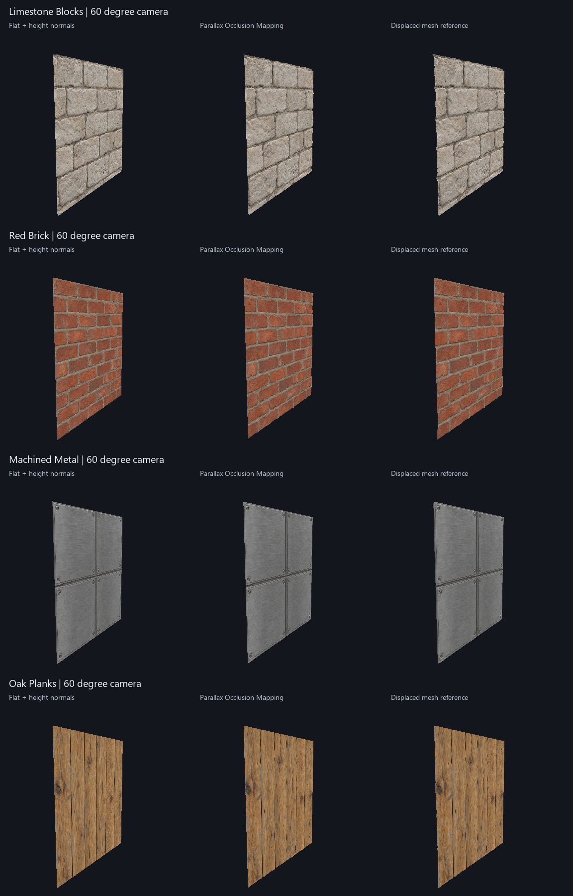

# POM visual and geometric validation

Run from the repository root using an installed Unity 6 editor and the project
Python environment with CuPy/CUDA available:

```powershell
.\scripts\test-unity-parallax.ps1 -UnityEditor 'C:\Program Files\Unity\Hub\Editor\6000.3.7f1\Editor\Unity.exe'
```

The script builds a disposable Unity project using that editor's bundled SRP
Core package. It retains the project and prints the locations of the log, numeric
report, comparison images, and animated GIFs. Unity runs on a real D3D11 device
with a five-minute timeout. Package import and editor licensing must work.

## What the comparisons measure

The renderer uses an actual perspective camera matrix, a two-unit square in the
XY plane, and a tangent frame facing +Z. The top of the height slab is Z=0.
Displaced vertices use `Z = -depth * (1 - height)`; POM uses `depth / 2` UV units.
The three columns share the camera, albedo, height data, and directional lighting:

1. A flat plane with height-derived lighting normals.
2. A flat plane using the shipped `TextureWorksParallaxSurface` function.
3. A 1024-by-1024 subdivided mesh, or 2,097,152 triangles, displaced on the CPU
   and depth-tested by the GPU. This reference path contains no POM trace.

The reference and baseline compute the height slope independently in the shader.
The POM column uses the shipped normal output. All slopes use the same physical
depth and central height differences. These are controlled diffuse lighting
renders, without a BRDF, cast shadows, or self-shadowing.

The four [generated inputs](../../textures/pom-validation/README.md) pass through
the actual height generators. Preparation compares CuPy with PTX, saves a 16-bit
PNG, loads it again, and passes those quantized values to Unity. Source/output
hashes and the presets are saved in `fixtures.json`. The height field is 256 by
256; albedo is 512 by 512. Full slab depths on the two-unit patch are:

| Material | Depth in world units | HeightScale per axis |
| --- | --- | --- |
| Limestone | 0.060 | 0.0300 |
| Brick | 0.040 | 0.0200 |
| Metal | 0.025 | 0.0125 |
| Wood | 0.035 | 0.0175 |

These are diagnostic presets. Inferred brightness is not measured geometry.
The light mortar in the brick image becomes raised, demonstrating an input
limitation that shader correctness cannot repair.

## Sampling and error calculation

The field uses bilinear filtering at LOD 0, with no height mipmaps and anisotropy
disabled. CPU interpolation explicitly places texel centers at `(index+.5)/size`
to match GPU sampling. Unity's
[GetPixelBilinear](https://docs.unity3d.com/6000.0/Documentation/ScriptReference/Texture2D.GetPixelBilinear.html)
uses a different coordinate origin. Using it directly displaced the reference
field by half a texel and contaminated the initial comparison.

Anisotropic filtering also changes the sampled field with view angle. In the
diagnostic investigation, increasing the march budget from 128 to 512 barely
changed that discrepancy. Matching the filtering removed it. The production
include retains `SampleGrad` so the consuming material can use its intended
filtering. This mesh comparison establishes agreement for the recorded LOD 0
field; it is not evidence for every production mip/filter configuration.

At each 384-by-384 render pixel, the diagnostic buffers store visible UVs from
POM and the mesh. Their Euclidean difference is expressed in **height texels**.
Measurements include mean, p95, p99, maximum, and the fraction above one texel.
The flat-plane error provides a baseline. Counts use pixels covered by both
surfaces with both UVs inside `[.08,.92]` on each axis. All silhouette/coverage
disagreements are counted separately and are not hidden inside the UV score.
Heatmaps use teal at zero error and red at one texel or more; excluded areas
have the background color.

The fixed sweep uses camera yaw 0, 35, 60, 75, and -60 degrees, with a 0.55-unit
camera elevation and a 45-degree field of view. Both 16/64 and 32/128 march
settings use six refinement iterations. A second sweep measures 25 frames per
material from -65 to +65 degrees at the default 16/64 settings. That makes 40
fixed comparisons and 100 motion comparisons. These test fixture gates require:

- At least 1,000 shared interior pixels.
- Finite output and mean error no greater than 0.05 height texels.
- p99 error no greater than 0.25 height texels.
- No more than 0.1% of measured pixels above one texel.

The finite mesh and hardware interpolation also have error. Rare large errors
can occur around nearly tangent occlusion boundaries, and finite march steps
can miss thin features. Passing these gates is a measured quality bound on these
fixtures, not an exact-intersection guarantee.

## Inspect the artifacts

`geometry-validation/overview.png` contains all four material comparisons.
`<material>-comparison.png` is a larger individual row.
`<material>-motion.gif` shows the three paths through a forward/back camera sweep.
Individual frame PNGs, error heatmaps, and `report.json` remain available for
closer inspection. Labels and GIF assembly are reproducible with:

```powershell
.\.venv\Scripts\python.exe -m scripts.summarize_parallax_validation '<project>/geometry-validation'
```

Inspect mortar and panel seams for the direction of occlusion, and compare the
POM column with the mesh as the camera moves. The outline is expected to differ:
the include changes UV sampling and lighting, while the reference has displaced
vertices. A clipped POM edge cannot extend past the original plane silhouette.

The initial fullscreen synthetic preview has been removed. Its artificial view
vector had no matching camera projection, its relief was excessive relative to
the tile size, and its normal strength described a different surface depth.

## Recorded validation: 2026-09-08

Unity 6000.3.7f1, SRP Core 17.3.0, Direct3D11, NVIDIA GeForce RTX 5070:
33 analytic GPU checks and all 140 mesh comparisons passed. Python 3.14/CuPy 14
passed all 51 pytest cases with zero skips. The four generated inputs had a
maximum CuPy/PTX height difference of `5.96046448e-08` in normalized values.

| Comparison set | Cases | Measured pixels | Worst mean error | Worst p99 error | Largest fraction over 1 texel |
| --- | --- | --- | --- | --- | --- |
| Fixed, default 16/64 | 20 | 581,926 | 0.00529 | 0.01460 | 0.0458% |
| Fixed, high 32/128 | 20 | 581,926 | 0.00484 | 0.01453 | 0.0382% |
| Motion, default 16/64 | 100 | 3,641,418 | 0.00287 | 0.00848 | 0.0143% |

Errors are in height texels and percentiles are calculated per render. Rare
individual errors reached 6.04 texels at occlusion boundaries; the percentile
scores do not imply that every pixel matched. Both fixed sets measure the same
pixels at different quality settings.

The [complete numeric report](assets/parallax/report-20260908.json),
[four-material overview](assets/parallax/overview.png), and
[limestone camera sweep](assets/parallax/limestone-motion.gif) are retained here.
The tested HLSL SHA-256 with LF line endings is
`8d3a1c74dc2caee5a3711bc3bc62e47f21a6f0fb2d44746e165174beeb2912a2`.

The overview and sampled sweep frames were inspected. Interior relief and
lighting track the displaced reference; the expected silhouette difference is
visible. The brick field retains its raised-mortar input limitation. No complete
Shader Graph or target-platform build was accepted by this run.



## Acceptance boundary

The harness verifies the shipped include with Unity's real SRP texture types,
analytic intersections and normals, generated input maps, and independent mesh
rasterization. It does not create a URP Lit Shader Graph or a target-platform
build. Production filtering, target GPU frame cost, tangent/UV transforms, graph
passes, and depth/shadow interactions need validation in the consuming project.
Follow the [integration checklist](../how-to/parallax-occlusion-mapping.md).
